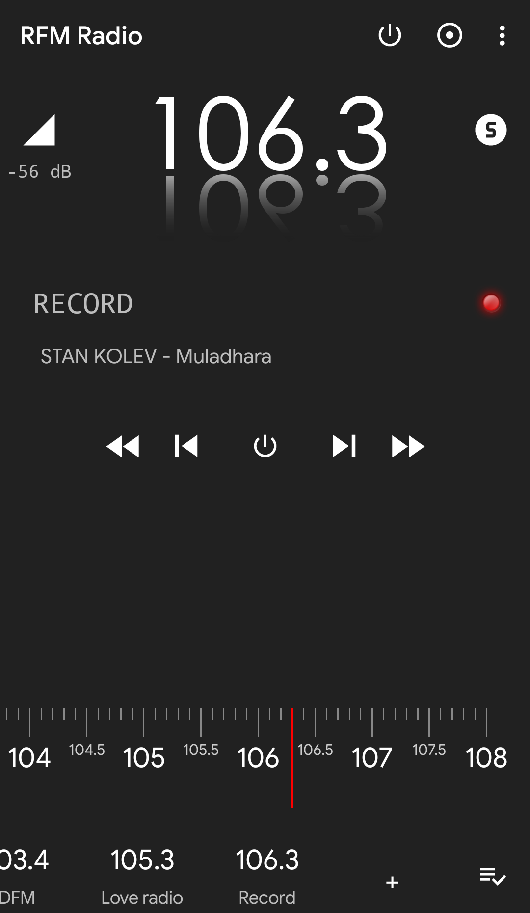
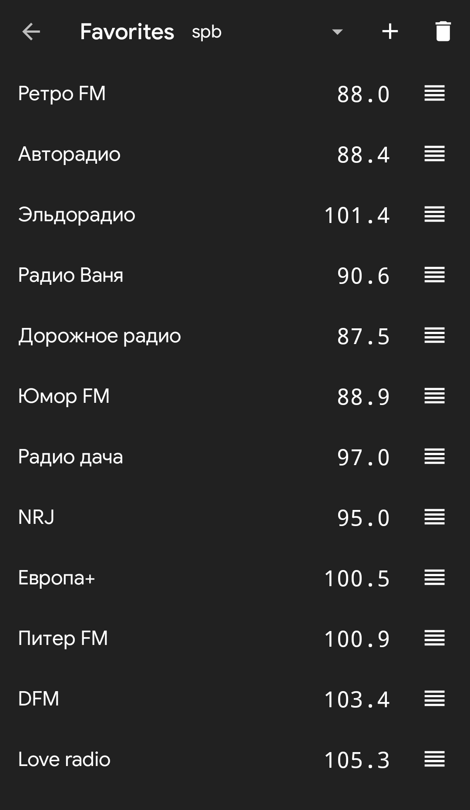

# Real FM Radio 

I think the right way to make radio work in recent android versions is with https://www.apkmirror.com/apk/lineageos/fm-radio-10/fm-radio-10-13-release/fm-radio-13-android-apk-download/ or https://github.com/iusmac/RevampedFMRadio

Updated SDK and requiered premissions to run on android 14 and 15

Real hardware radio for Android smartphones based on Qualcomm Snapdragon 2xx, 4xx and 6xx processors (up to 625 and 650).

## Requirements

* To use you need **root** in Android (more emphasis placed on AOSP).
* Android 5.1+ (SDK 22+).

## Capabilities

* Listening to the radio.
* Reading RDS: PS, RT and PTY.
* Display the signal strength in dB.
* Radio recording in `.wav` and `.mp3` files.
* Saving favorite frequencies with name.
* Ability to create multiple favorites lists.

## Settings
### Tuner
#### Tuner driver

Provides a choice of "driver" to work with the radio chip.
* **Qualcomm V4L2 driver - official**, slightly modified driver from Qualcomm
* **Qualcomm V4L2 service from Spirit3** - an empirically written driver for Spirit2 written by Mike Reid. Choosing this driver requires the installed Spirit3 application version 3.0.11 or higher. (Spirit2 will not work due to path incompatibility)

#### Enable RDS

RDS is a radio data system.
When this option **is enabled**, the application will display data transmitted from the radio station, such as the Program Service and Radio Text.

#### Antenna

Select an antenna. In most cases: 0 - default, headphones; 1 - internal (bad quality).

### Audio
#### Audio service

Select an audio service that will record sound inside the application before playing it.
* **Lightweight audio service** is the simplest service. Should work in most cases.
* **Audio service from Spirit3** - a service from Spirit3 with more accurate work with memory. The installed Spirit3 application is **not required**.

#### Audio source

Select a source for record audio inside the application.
* For modern devices should work "1998, FM".
* For older devices - "0, DEFAULT" (at the same time, sounds from the microphone can be heard when using the *Qualcomm driver*)

### Application
#### Autostart

If enabled, audio from the radio will be immediately turned on after starting the application.

### Notifications
#### Show PS in title

If the option is enabled, then with the "Enable RDS" option enabled, the Program Service and Radio Text will be displayed in the notification header.

## Screenshots

## Building

To modify the code of the native part of the application, Android NDK headers files are required.

## Inspired by

> Spirit1 and Spirit2 by Mike Reid.
>
> R.I.P. 2016

## Disclaimer

The application uses several sources of code:
1. Hard-to-piece collected documentation for Tavarua, Iris, I2C, V4L2.
2. GUI code written by the developer of this application.
3. If Spirit3 is installed, this application can use its assembled binary file as a driver.

### Contributors
* Vladislav Veluga (@vladislav805) &mdash; developer;
* Mike Reid (@mikereidis) &mdash; developer of Spirit 1/2;
* Konstantin Manaev (@SoSlowMan) &mdash; translator (English);
* Andus (@AndusDEV) &mdash; translator (Polish).
