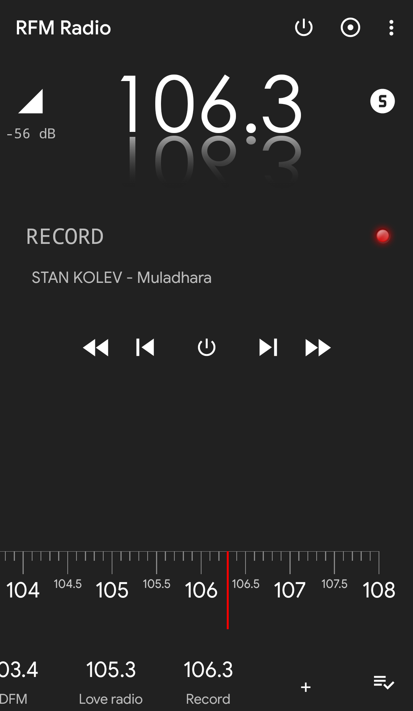
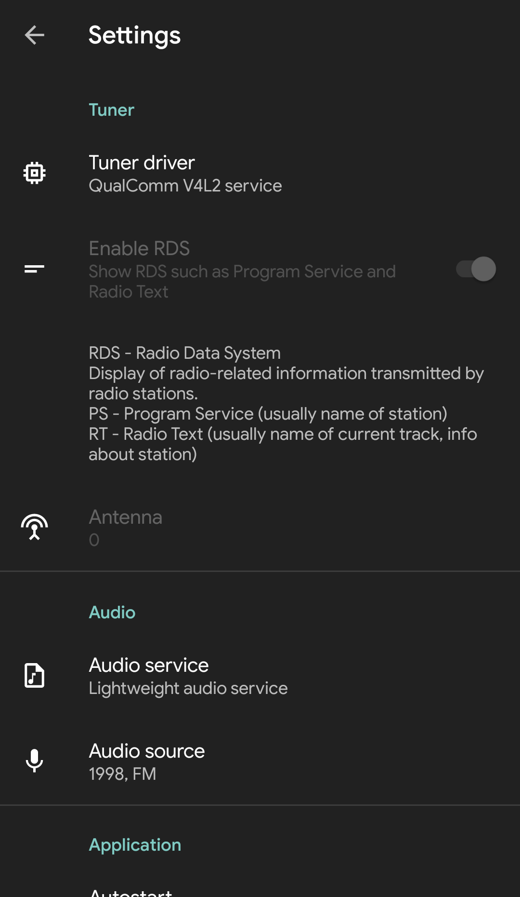
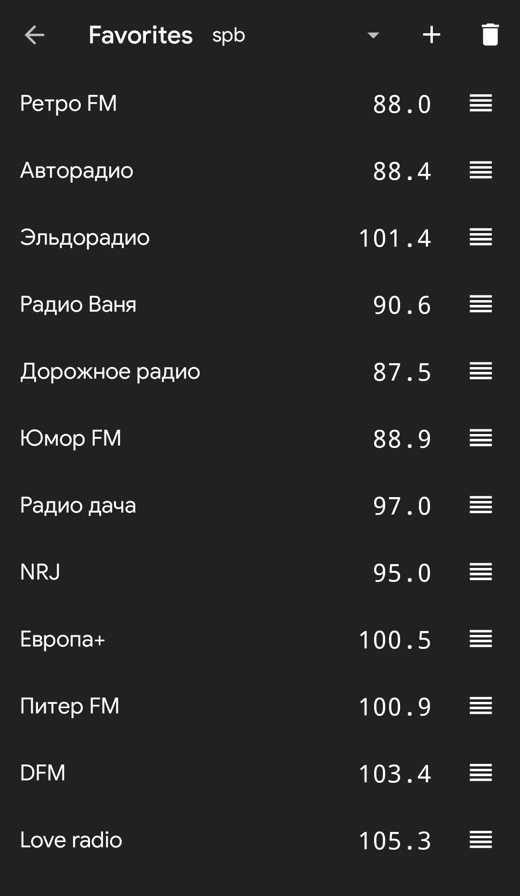

# Real FM Radio 

Real hardware radio for Android smartphones based on Qualcomm Snapdragon 2xx, 4xx and 6xx processors (up to 625 and 650).

## Requirements

* To use you need **root** in Android (more emphasis placed on AOSP).
* Android 5.1+ (SDK 22+).

## Capabilities

* Listening to the radio.
* Reading RDS: PS, RT and PTY.
* Display the signal strength in dB.
* Radio recording in `.wav` and `.mp3` files.
* Saving favorite frequencies with name.
* Ability to create multiple favorites lists.

## Settings
### Tuner

#### Enable RDS

RDS is a radio data system.
When this option **is enabled**, the application will display data transmitted from the radio station, such as the Program Service and Radio Text.

#### Antenna

Select an antenna. In most cases: 0 - default, headphones; 1 - internal (bad quality).

### Application
#### Autostart

If enabled, audio from the radio will be immediately turned on after starting the application.

### Notifications
#### Show PS in title

If the option is enabled, then with the "Enable RDS" option enabled, the Program Service and Radio Text will be displayed in the notification header.

## Screenshots

## Building

To modify the code of the native part of the application, Android NDK headers files are required.

## Inspired by

> Spirit1 and Spirit2 by Mike Reid.
>
> R.I.P. 2016

## Disclaimer

The application uses several sources of code:
1. Hard-to-piece collected documentation for Tavarua, Iris, I2C, V4L2.
2. GUI code written by the developer of this application.

### Contributors
* Vladislav Veluga (@vladislav805) &mdash; developer;
* Mike Reid (@mikereidis) &mdash; developer of Spirit 1/2;
* Konstantin Manaev (@SoSlowMan) &mdash; translator (English);
* Andus (@AndusDEV) &mdash; translator (Polish).
